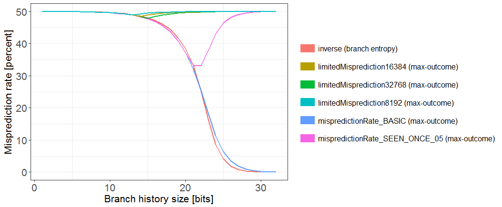

# README Branch Behavior Analysis

The IBM Platform-Independent Software Analysis tool provides an analysis that quantifies the predictability of the branch behavior of a program. To run such an analysis, the user should first generate a trace of branches and their outcomes. To generate such a trace, the user should instrument the application code using the following two analysis flags:```-branch-entropy -branch-entropy-file="filename"```. The IBM Platform-Independent Software Analysis tool will thus generate at runtime a trace with the name```filename```. An example of the trace format is shown below:

```
    | Branch type | Function_ID | BasicBlock_ID | Instruction_ID | T/F | Thread_ID | Processor_ID|
    ub 0 0 5 1 0 0
    cb 0 1 11 1 0 0
    cb 0 1 13 1 0 0
```

For example, the first branch in the example above is characterized as follows. It is an unconditional branch (ub), the branch instruction is in function 0 (as found in the instrumented bitcode), in basic block 0 of function 0 (also as found in the instrumented bitcode), it is the 5th instruction in the basic block, the branch outcome is true (1) and the branch instruction was executed by thread number 0 of process number 0. Single-threaded, single-process programs will always have "0 0" in the last two columns of the trace for all branches. 

Then the trace will be input to a separate program```branchBehavior.cc``` that quantifies the predictability of the branch behavior of a program. This separate program calculates the [branch entropy](https://link.springer.com/chapter/10.1007/978-3-540-78153-0_21) and the maximum branch outcome method proposed in chapter 4.4.4 [here](https://doi.org/10.3929/ethz-b-000212482). While the first metric only takes into account the size of the global or local history size, the latter metric can also take into account the limited size of the branch pattern table. The output will be a .csv file which includes the values of the branch behavior characterization metrics. 


- How to compile the```branchBehavior.cpp``` code? The code must be compiled as follows.
```
    g++ -O3 branchBehavior.cc --std=c++11 -o branchBehavior
```

- How to execute the```branchBehavior.cpp``` code?
```
    ./branchBehavior input_file_name history_buffer_size global_or_local_flag
    input_file_name: char type (the branch trace)
    history_buffer_size: numeric type (maximum value: 64)
    global_local_flag: numeric type (0 for global or 1 for local analysis)
```

- What is the format of the input file to```branchBehavior.cpp```?

The user should use the provided```filter.sh``` bash script to generate the input file from a raw branch trace generated by the IBM Platform-Independent Software Analysis tool. Run```./filter.sh filename filename.out```. Use```filename.out``` as input to the branch behavior characterization program (branchBehavior).
    
- What is the format of the output file? An example of an output file is provided below. 
```    
windowSize,entropy,difference,approxInverse,inverse,mispredictionRate_BASIC,mispredictionRate_SEEN_ONCE_05,mispredictionRate_SEEN_FIRST_05,mispredictionRate_SEEN_ONCE_DISCARDED,mispredictionRate_SEEN_FIRST_DISCARDED,limitedMisprediction32768,limitedFractionNotStored32768,limitedMisprediction16384,limitedFractionNotStored16384,limitedMisprediction8192,limitedFractionNotStored8192,limitedMisprediction4096,limitedFractionNotStored4096,limitedMisprediction2048,limitedFractionNotStored2048,limitedMisprediction1024,limitedFractionNotStored1024,limitedMisprediction512,limitedFractionNotStored512,limitedMisprediction256,limitedFractionNotStored256,limitedMisprediction64,limitedFractionNotStored64,limitedMisprediction32,limitedFractionNotStored32,limitedMisprediction8,limitedFractionNotStored8,nHistoryPatterns,nBranches0,nBranches1,nBranchesMore
1,0.9994,0.9994,0.4856,0.4856,0.00966184,0.00966184,0.0143993,0.00966184,0.00966178,0.0144928,0,0.0144928,0,0.0144928,0,0.0144928,0,0.0144928,0,0.0144928,0,0.0144928,0,0.0144928,0,0.0144928,0,0.0144928,0,0.0144928,0,2,0,0,2
2,1.07812,0.0787182,0.0097,0.0097,0.00970874,0.0145631,0.0193223,0.00980392,0.00980388,0.0194175,0,0.0194175,0,0.0194175,0,0.0194175,0,0.0194175,0,0.0194175,0,0.0194175,0,0.0194175,0,0.0194175,0,0.0194175,0,0.0194175,0,4,0,2,2
3,1.1573,0.0791794,0.0098,0.0098,0.0097561,0.0195122,0.0242931,0.00995025,0.00995023,0.0243902,0,0.0243902,0,0.0243902,0,0.0243902,0,0.0243902,0,0.0243902,0,0.0243902,0,0.0243902,0,0.0243902,0,0.0243902,0,0.0243902,0,6,0,4,2
4,1.23694,0.0796417,0.00985,0.00985,0.00980392,0.0245098,0.0293127,0.010101,0.010101,0.0294118,0,0.0294118,0,0.0294118,0,0.0294118,0,0.0294118,0,0.0294118,0,0.0294118,0,0.0294118,0,0.0294118,0,0.0294118,0,0.0294118,0,8,0,6,2
```


## FAQ

- What is the difference between global and local? 

The branch behavior metric can be computed across all the branches of a program (regardless of their function ID, basic block ID or instruction ID) or per branch. The first one is called global analysis, while the latter is called local analysis. The local one computes the metric per branch and it averages the metric values across branches. A branch is identified based on three identifiers: the function ID, the basic block ID and the instruction ID. The branch entropy analysis has been tested with global and local, while the maximum outcome metric only with global analysis.
    
- What is the meaning of the different columns in the output .csv file? 

The most relevant metrics in the output are the following:
```
    windowSize: history buffer size (n)
    entropy: entropy(n)
    difference: entropy(n+1)-entropy(n), also called branch entropy.
    approxInverse: misprediction rate based on branch entropy: the misprediction rate is calculated based on one single branch entropy number --the difference value-- calculated across all branches.
    inverse: misprediction rate based on branch entropy: the misprediction rate is calculated as a weighted average of misprediction rates across branches weighted with the number of occurences per branch. The inverse and approxInverse values are the same for the global branch analysis.
    mispredictionRate_BASIC: misprediction rate based on the max-outcome metric (infinite branch pattern table size).   
    mispredictionRate_SEEN_ONCE_05: misprediction rate based on the max-outcome metric (infinite branch pattern table size, branches that are seen only once are given a misprediction rate of 0.5).   
    limitedMisprediction32768: misprediction rate based on the max-outcome metric (table pattern size of 32768 entries).   
    nHistoryPatterns: number of history patterns (sequences of n symbols of 0 and 1).
    nBranches0: number of branches with outcome 0 (false).
    nBranches1: number of branches with outcome 1 (true).
``` 

- Would it be possible to provide an example of how to use the branch behavior analysis?
    
Let's assume that our design-space exploration scenario is the following. We would like to explore global history buffer sizes from 2 to 32 and determine an estimate of the branch misprediction rate for each size. We are interested in the global branching behavior of the program. We are also interested in understanding the impact of the size of the branch pattern table. We analyze branch pattern table sizes of 8192, 16384 and 32768 entries. These sizes are currently hard coded in addition to sizes of 8, 32, 64, 256, 512, 1024, 2048 and 4096. We use as input the random trace provided [here](https://github.com/exabounds/ibm-pisa/blob/master/branch-analysis/random_10M.test.trace.gz). This trace was generated using a random generator of 0s and 1s. We run the branch behavior analysis program and the results are shown below. 
